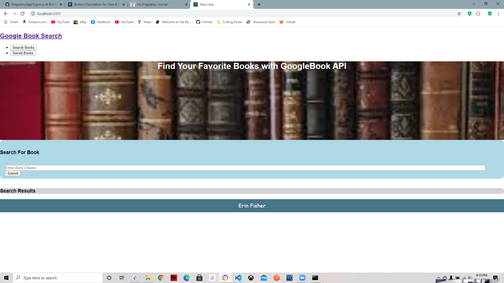

# Google-Book-Search




>Search and Save Books for a later purchase

---

### Table of Contents

* [Description](#description)
* [How To Use](#how-to-use)
* [References](#references)
* [License](#license)
* [Author Info](#author-info)

---

## Description
What is this project about. Who is the User? What is the purpose of this application? 

#### Technologies

- React
- Express
- Node.js

---

## How To Use

#### Installation
Starting the app locally

Start by installing front and backend dependencies. While in this directory, run the following command:

```
npm install
```

This should install node modules within the server and the client folder.

After both installations complete, run the following command in your terminal:

```
npm start
```

Your app should now be running on <http://localhost:3000>. The Express server should intercept any AJAX requests from the client.


#### API Reference
None

[Back To The Top](#Google-Book-Search)

---

## References
[Back To The Top](#Google-Book-Search)

---

## License


Copyright(c) [2020] [Erin K Fisher]

[Back To The Top](#Google-Book-Search)

---

## Author Info

- GitHub - [FisherE20](url)
- Website - [FisherE20](url) 

[Back To The Top](#Google-Book-Search)
